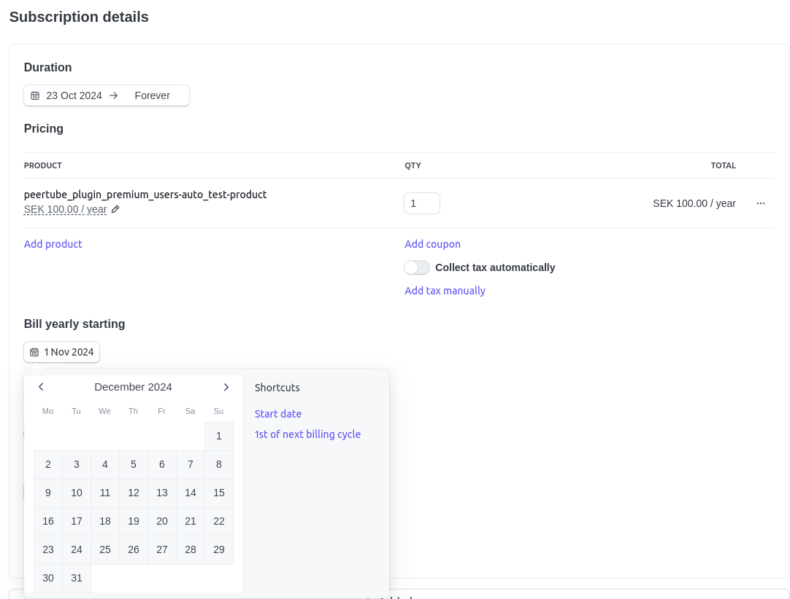

# PeerTube plugin premium users

## About
This plugin will add a video field where uploaders can choose whether the video is a premium video or not. Premium videos will only be shown for paid users, other users will see a preselected default video.
To become a premium user a user has to go to My account > Premium and click "Subscribe to become a premium user". He will then be redirected to Stripe and when the checkout is complete he's a premium user.

### How to manually add premium users
1. Login to [Stripe dashboard](https://dashboard.stripe.com/).
1. Go to _Customers_.
1. Open the customer you want to add as premium.
1. Click on add subscription.
1. Select the product.
1. At "Bill yearly/monthly starting", select the date where the billing should start.

## Prerequisites
* Stripe API key.
* Stripe webhook listening for `checkout.session.completed`, `customer.subscription.created`, `invoice.paid` and `invoice.payment_failed` pointed to `{PEERTUBE_URL}/plugins/premium-users/router/stripe-webhook`.
* Stripe product whom premium users will subscribe to.
* Replacement video to be shown for non-premium users.

## TODO:
* ~Support for cancel subscriptions.~
* ~Remove payments from DB and get from API instead.~
* ~Create checkout from API instead of static URL.~
* ~Support change payment method.~
* ~Listen to webhook to know when subscription has ended.~
* Verify paymentStatus is accurate upon GET /subscriptions
* ~Change storage to Postgres~
* ~Add Google Analytics support.~
* Notify user about a failed payment.

## Demo / testing
Prerequisites:
* Copy `demo/.env.stripe_example` to `demo/.env.stripe` and fill in your Stripe API token for test environment.

* `cd demo`
* `STRIPE_API_KEY=sk_test... npm start`
* `open http://localhost:9000`

### Run e2e tests
* `npx playwright install --with-deps`
* `npx playwright test`

## Development

### Run GH actions locally
`act -s STRIPE_API_KEY=sk_test_... --artifact-server-path /tmp/artifacts`